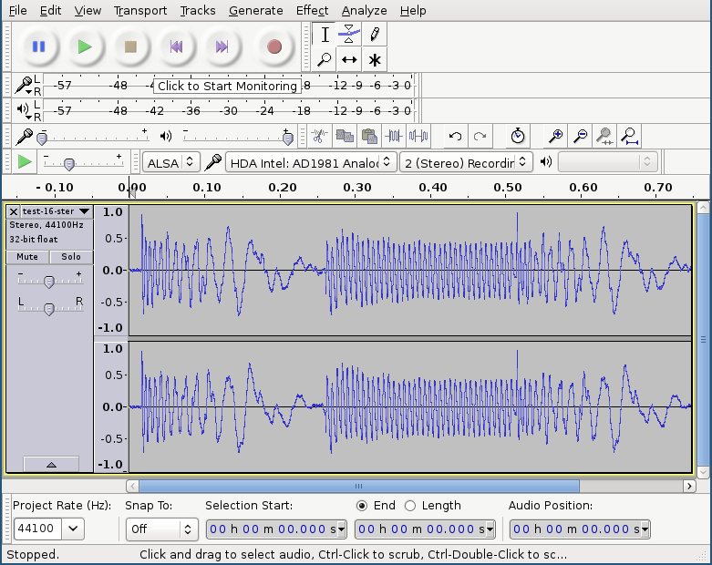
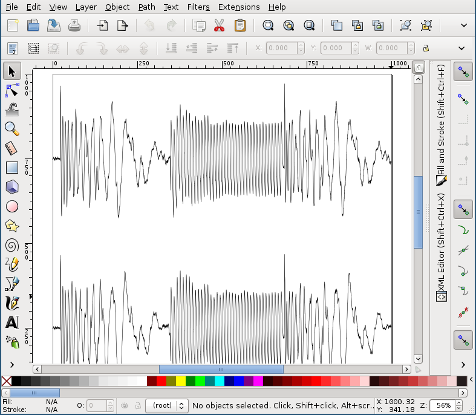

:toc:
:toc-placement!:

= wav2vec

toc::[]

== Introduction

`wav2vec` is a Python script and package for converting waveform files (WAV or AIFF) to vector graphics (SVG or PostScript). Use cases include using an audio waveform as an element in a graphic design or including a waveform in a document.

== Features

* Portable: runs on Python 2.7+ and Python 3 and does not depend on any third-party packages.
* Supported PCM input file formats:
** 8-bit signed AIFF
** 8-bit unsigned WAV
** 16-bit signed WAV and AIFF
** 32-bit signed WAV and AIFF
* Input file format is automatically detected and handled (the file name/extension is unimportant)
* Output file formats:
** Scalable Vector Graphics (SVG)
** PostScript
** Comma-Separated Values (CSV)
* Easy to write a custom output formatter
* Options to scale the output data
* Can process input files in chunks so large files can be processed with minimal memory

== Install

=== From PyPI with PIP
The easiest way to install `wav2vec` is to use `pip` to install from the Python Package Index:

[source, sh]
----
$ pip install wav2vec
----

Depending on your system, in order to install in the Python 3 path, you may have to use `pip3` instead of `pip`.

=== From git repo

Alternatively, clone the git repository:

[source, sh]
----
$ git clone https://github.com/cristoper/wav2vec.git
$ cd wav2vec
----

Now you can run `wav2vec.py` directly:

[source, sh]
----
$ python wav2vec.py -h
----

Or install the package with PIP:

[source, sh]
----
$ pip install .
$ wav2vec -h
----

== Usage

Once the package is installed using pip (see above), the command can be invoked as `wav2vec`. It takes an input file and outputs (SVG, by default) to stdout:

[source, sh]
----
$ wav2vec filename.wav > filename.svg
----

Run `wav2vec -h` to get a usage summary:

----
usage: wav2vec [-h] [--format {PostScript,SVG,CSV}] [--width WIDTH]
               [--height HEIGHT] [--stream BS] [--downtoss N]
               [--log {DEBUG,INFO,WARNING,ERROR,CRITICAL}]
               filename

Convert WAV and AIFF files to vector (SVG, PostScript, CSV) graphics.

positional arguments:
  filename              The WAV file to read

optional arguments:
  -h, --help            show this help message and exit
  --format {PostScript,SVG,CSV}, -f {PostScript,SVG,CSV}
                        The output format, one of: SVG, CSV, PostScript.
                        Default is SVG.
  --width WIDTH         Maximum width of generated SVG (graphic will be scaled
                        down to this size in px)
  --height HEIGHT       Maximum height of generated SVG (graphic will be
                        scaled down to this size in px). Note that this scales
                        according to the highest possible amplitude (given the
                        sample bit depth), not the highest amplitude that
                        actually occurs in the data.
  --stream BS           Stream the input file size in chunks (of BS number of
                        frames at a time) and process/format each chunk
                        separately. Useful for conserving memory when
                        processing large files, but note that multi-channel
                        paths will be split up into BS-sized chunks. By
                        default BS=0, which causes the entire file to be read
                        into memory before processing.
  --downtoss N          Downsample by keeping only 1 out of every N samples.
  --log {DEBUG,INFO,WARNING,ERROR,CRITICAL}
                        Set the logging level.

The output is sent to stdout.

----

=== Options
==== Output format

The `--format` flag sets the output format. `wav2vec` includes three formatters: `SVG` (default if no `--format` is given), `PostScript`, and `CSV`.

[source, sh]
----
$ wav2vec filename.wav --format PostScript > output.ps
----

==== Scale output

Use the `--width` and `--height` options to scale the output so that its maximum bounds are equal to or less than the values following the flags. In SVG these values are pixels ("user units"); in PostScript the values are interpreted as pts (1/72 of an inch). By default (if the flags are not given), the width is set to 1000 and the height to 500.

[source, sh]
----
$ wav2vec filename.wav --width 500 --height 350 > output.svg
----

==== Stream input file

By default, `wav2vec` reads the entire input file into memory and then streams the output to stdout as it process it. Passing the `--stream` flag will cause `wav2vec` to process the input file in chunks. This can be useful if the input file is very big and won't fit into available memory. The `--stream` flag requires one argument, the number of frames to read and process at a time (each frame includes one sample from each channel). A value of around 1024 seems to work well.

[source, sh]
----
$ wav2vec filename.aiff --stream 1024 > output.svg
----

Note that using the `--stream` flag on files with multiple channels will result in non-continuous paths in the output (because channel data is interleaved in WAV/AIF files).

Note also that converting very large audio files to SVG may not be practical: most SVG editors will not handle paths with hundreds of thousands or millions of points well.

==== Downsampling

The `--downtoss N` flag will keep only 1 out of every N samples. This is a brutal form of downsampling which will clobber high frequency and add aliasing noise. It's best to instead downsample in your waveform recorder/editor before processing (or in your drawing program after processing).

=== API

You can also `import wav2vec` in order to convert wave files to the supported output formats in your own Python scripts. The package provides two main classes: `WavDecoder` and the abstract `Formatter` (and the concrete implementations: `SVGFormatter`, `PSFormatter`, and `CSVFormatter`). The documentation is currently contained in the source files; look at link:./wav2vec/main.py[main.py] for an example of usage.

The `WavDecoder` class wraps the standard library's `wave` and `aifc` modules and provides an easy way to read and decode WAV/AIFF files.  Use it as a context manager to ensure `close()` is called. Use it as an iterator to process all frames:

[source, python]
----
>>> wd = WavDecoder('filename')
>>> with wd as data:
>>>     for frames in data:
>>>         print(frames)
----

See link:./wav2vec/WavDecoder.py[wav2vec/WavDecoder.py].

The `Formatter` class is an abstract base class which defines the interface for all formatters which output WAV data in textual formats. Each concrete subclass of `Formatter` takes a `WavDecoder` object in its constructor which is what is responsible for reading/decoding data from a WAV or AIFF file.

The `output()` method will stream output to a file (stdout by default), but the entire output string can be captured using the `__str__()` method.

[source, python]
----
>>> wd = WavDecoder("filename")
>>> svgformatter = SVGFormatter(wd)
>>> svgformatter.output() # outputs SVG to stdout
>>> svg_str = str(svgformatter) # get SVG as a string
----

See link:./wav2vec/formatter/[the formatter package].

=== Examples

==== SVG

Here's what the link:tests/valfiles/snd/test-16-stereo.wav[tests/valfiles/snd/test-16-stereo.wav] file looks like in Audacity:

We can convert it to an SVG and then open it in Inkscape:

[source, sh]
----
$ wav2vec tests/valfiles/snd/test-16-stereo.wav > test.svg
$ inkscape test.svg
----

Then we can use Inkscape to non-destructively add filters and path effects and otherwise incorporate the waveform into a design:

==== PostScript

To convert to PostScript instead of SVG:

[source, sh]
----
$ wav2vec tests/valfiles/snd/test-16-stereo.wav -f PostScript > test.ps
$ ps2pdf test.ps
$ evince test.pdf
----

The above uses the Ghostscript `ps2pdf` tool to convert the resulting PostScript file to PDF and then opens it in the evince PDF reader (shown in the screenshot below). You could instead open `test.ps` directly in a PostScript viewer (or send it to a printer/plotter, or embed it in a LaTeX document, etc).

image::./readme_imgs/evince.png[]

==== CSV

`wav2vec` also comes with a CSV formatter, which is useful to get WAV data into a spreadsheet:

[source, sh]
----
$ wav2vec tests/valfiles/snd/test-16-stereo.wav -f CSV --height 0 > test.csv
$ libreoffice test.csv
----

Note the `--height 0` option which prevents `wav2vec` from scaling the raw PCM values.

== Hacking

=== Run tests

To run unit and validation tests (requires python3):

[source, sh]
----
$ python -m unittest discover
----

=== Write custom formatter

Creating a custom formatter is simply a matter of subclassing `Formatter` and overriding the five abstract methods it defines. Use the included SVGFormatter, PSFormatter, or CSVFormatter as a template (see link:./wav2vec/formatter/formatters.py[wav2vec/formatter/formatters.py]).

== Issues

Please feel free to use the Github issue tracker as a support forum for any questions, suggestions, bug reports, or feature requests. Thanks! https://github.com/cristoper/wav2vec/issues

== See also

- http://www.audacityteam.org/[Audacity] is a good Free audio recorder and waveform editor.
- https://inkscape.org/en/[Inkscape] is a Free SVG-based drawing program
- https://www.ghostscript.com/[Ghostscript] is a Free PostScript interpreter which can distill to PDF.

- https://github.com/afreiday/php-waveform-svg[php-waveform-svg] is a PHP script for converting mp3->wav->svg. (It looks simple, but I haven't tried it.)

== Support the Author

If this script was useful to you, please consider supporting my work on this and other open-source projects by making a small one-time donation: https://www.paypal.com/cgi-bin/webscr?cmd=_s-xclick&hosted_button_id=E78W4LH2NADXE[donate via PayPal].

If you're looking to contract a Python developer, I might be able to help. Contact me, Chris, at dev@orangenoiseproduction.com
